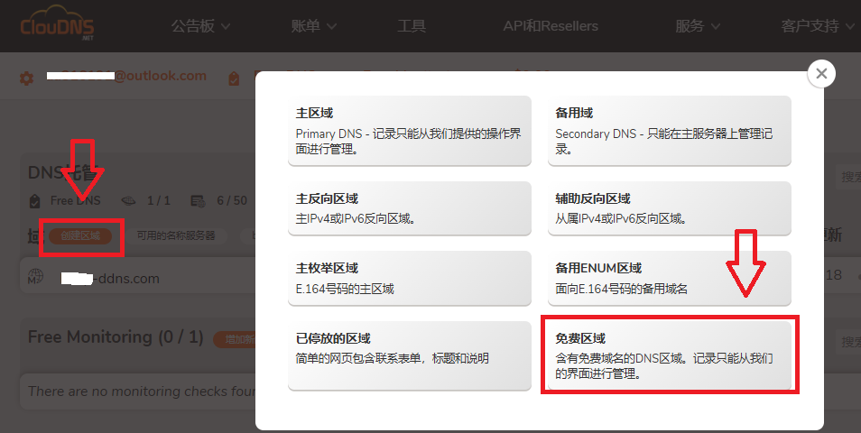
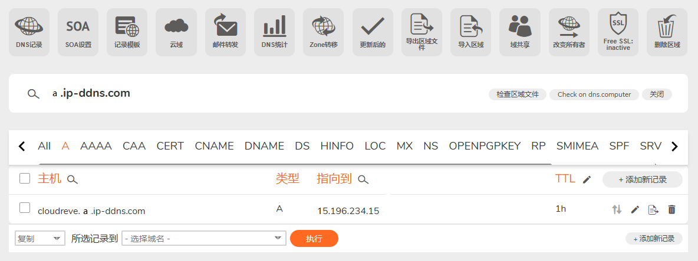

# cloudreve部署方法（arm64）

<br>

### 本教程仅适用debian和ubuntu系统的vps

<br>

## 1.检测系统构架

```bash
uname -m

```

显示 aarch64 继续看下一步

显示 x86_64 去看主页

https://github.com/lisi-123/cloudreve-selfuse

其他构架请前往Cloudreve官方寻找对应的包自行部署

Cloudreve项目地址 https://github.com/cloudreve/Cloudreve

<br>
<br>

## 2.拉取项目

```bash
apt-get update && apt install sudo -y && sudo apt install git -y && git clone -b arm64 --single-branch https://github.com/lisi-123/cloudreve-selfuse.git

```

<br>
<br>

## 3.运行

首次运行：

```bash
sudo chmod +x /root/cloudreve-selfuse/cloudreve-start.sh && sudo /root/cloudreve-selfuse/cloudreve-start.sh

```

Cloudreve首次运行后，会自动生成配置

保存自动生成的管理员账号(Admin user name)和密码(Admin password)

在浏览器打开 http://你的ip:5212

如果不喜欢 5212 这个默认端口，执行：

```bash
read -p "请输入端口号: " PORT && sed -i "s/^Listen = :.*/Listen = :$PORT/" /root/cloudreve-selfuse/conf.ini
```

更换为你需要的端口（不建议使用 80 和 443 ，因为之后的nginx要用）

<br>
<br>

## 4.使用screen实现持续运行

目前，ssh断开连接就会导致cloudreve停止运行

在 cloudreve **停止运行** 的情况下，执行以下内容


```bash
sudo chmod +x /root/cloudreve-selfuse/cloudreve-running.sh && sudo /root/cloudreve-selfuse/cloudreve-running.sh

```

执行后，cloudreve会在后台后自动启动（断开ssh连接也能保持运行）

且每十分钟检测一次网盘是否运行，如果网盘没有运行，则启动网盘

<br>

## 5.使用nginx开启https

如果已经有域名，给域名添加一条A记录，ip填vps的ip，然后执行以下命令

```bash
sudo chmod +x /root/cloudreve-selfuse/nginx.sh && sudo /root/cloudreve-selfuse/nginx.sh

```
<br>

如果没有域名，可以去 https://www.cloudns.net 获取免费的域名

cloudns 支持中文界面，记得去右上角切换

前往 cloudns 注册一个账号（需要邮箱验证）

注册登录后，点击“创建区域”，选择“免费区域”



如果提示创建不了，大概率是节点ip风控

换干净的节点，浏览器开隐私模式，然后登录重试

创建域名后，给域名添加一条A记录，ip填vps的ip

添加好之后，大概是这样



然后等待五到十分钟，确认解析生效后，执行上面的命令

<br>

## 6.迁移方法

如果按我的教程部署过cloudreve

现在需要把 **旧vps** 上的cloudreve数据迁移到 **新vps** 上

数据迁移实际上是在第二步和第三步中间，加一个**传输数据**的步骤

所以首先要在 **新vps** 完成 “**1.检测系统构架**” ， “**2.拉取项目**”，然后执行

```bash
sudo apt install rsync -y

```

接下来打开 **旧vps** ，ssh连接后，执行

```bash
sudo chmod +x /root/cloudreve-selfuse/cloudreve-move.sh && sudo /root/cloudreve-selfuse/cloudreve-move.sh

```

执行后，根据提示填写 **新vps** 的用户名，ssh端口，ip，密码。然后等待传输


传输完成后，在 **新vps** 继续执行 **“3.运行"** 以及之后的步骤


<br>
<br>

有问题联系→ [@talkingstick233_bot](https://t.me/talkingstick233_bot)


